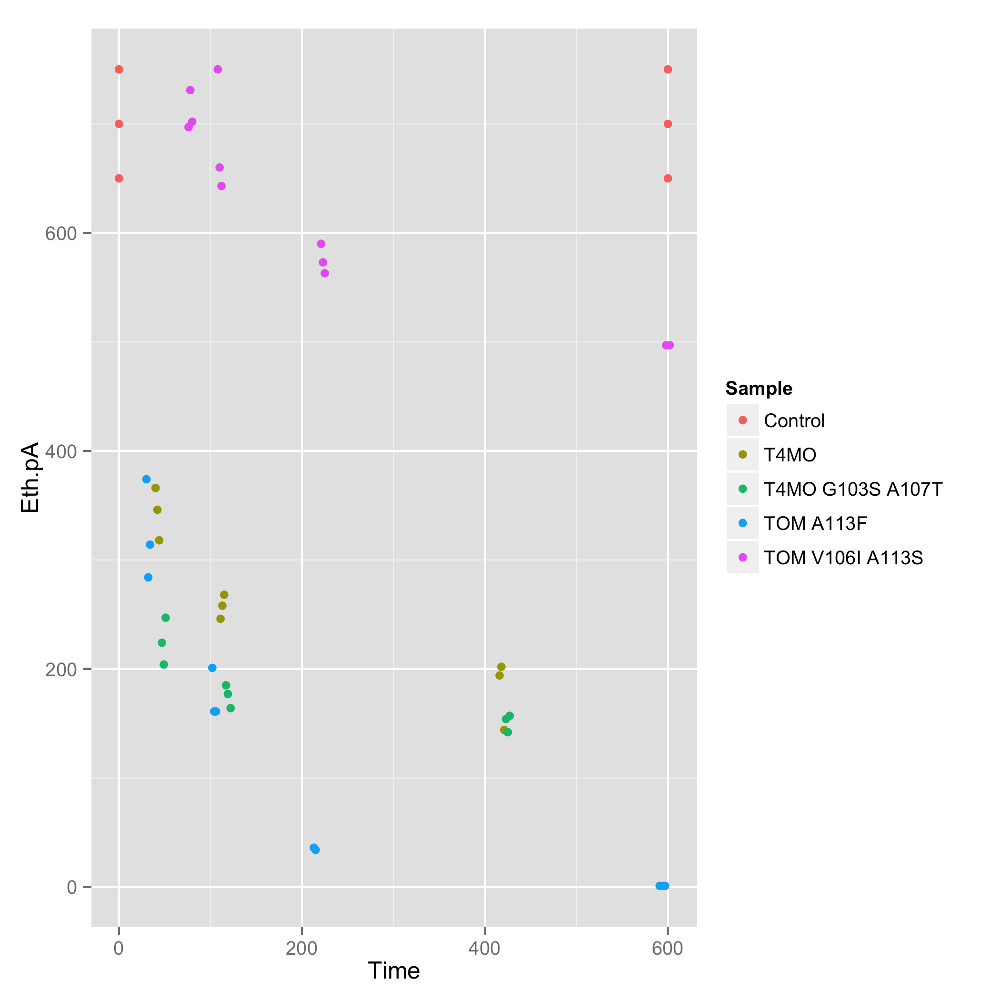

Introduction 
------------

"Ethylene oxide is an important raw material used in the manufacture of
chemical derivatives that are the basis for major consumer goods in
virtually all industrialized countries." (IARC 2008) Commercial production
began in 1914 and by 2009, had reached 20 million tons annually.
Currently, a multi-unit industrial process in which gaseous ethylene and
oxygen are reacted over silver catalyst at high temperature and pressure
(300 C and 3 MPa are common) is used to produce ethylene oxide (IUPAC name:
oxirane) from ethylene. Even with the latest and best-developed industrial
methods, continual replacement of the silver catalyst and scrubbers is
necessary and the maximum degree of conversion is 85.7% (the rest is lost
to carbon monoxide which must be scrubbed). Ethylene oxide's stance as
a key raw material which satisfies demand for 10% of worldwide ethene
production justifies the invention of better methods for the production of
oxirane from ethylene. 

Biological catalysts are becoming the tool of choice for synthetic
reactions because of their selectivity and ability to perform reactions of
interest under mild, nontoxic conditions. The epoxidation of ethene to
yield oxirane is an example of a reaction particularly suited to biological
catalysis. Theoretical yeild is 100%, and, in constrast to current
industrial catalysts, biological catalysts are indefatigable and last
indefinitely as they are constantly being produced by microrganisms, and
the low temp mild conditions are conducive to its handling as
a refrigerated liquid (virtually all industrially-produced oxirane is
handled this way). These conditions also promote the formation of ethylene
glycol, a transformation that consumes 75% of oxirane produced globally
each year. TMOs could easily be combined in a pathway with a suitable
epoxide hydrolase to produce ethylene glycol directly from ethene.
(Possible future grant/paper? 1EHY, a 294 AA epoxide hydrolase from
agrobacterium radiobacter ad1, has been expressed in Escherichia coli
bl21(de3) for crystallization.)

 Reaction scheme. 

In nature, the epoxidation of alkenes is carried out by a group of alkene
monooxygenases that use molecular oxygen and NADH. The expression of these
enzymes in an industrial host such as *Escherichia coli* has to date been
an elusive goal. We performed a sequence homology search to identify
candidate enzymes which had been shown to function in *E. coli* and found
toluene-o-xylene monooxygenase (T4MO) of *Pseudomonas stutzeri* and
toluene ortho-monooxygenase (TOM) of *Burkholderia cepacia G4*. These two
closely-related (identity: xx% and xx% to AMO) enzymes that have been shown
to degrade chlorinated ethenes, and a 2.1 A crystal structure of T4MO is
available (Sazinsky 2004). Based on the proposed enzymatic mechanism, we
hypothesized that these enzymes would oxidize ethene to yield oxirane. 

To test our hypothesis that this enzyme would have specific acitivity on
ethene, we assayed for ethene degradation and oxirane production in whole
cells expresing T4MO. After preliminary findings of activity, a small
library (n=18) of mutants generated by shuffling mutagenesis (Wood 2001)
that had undergone directed evolution for degradation of chlorinated
ethenes was tested on unsubstituted ethene. 

Results and discussion 
----------------------

For example, 1000 nm of ethene is degraded over 100 minutes, but how many
mgs of protein are there in the 1 mL vials? 

We found a variety of activites on ethene, as pictured. Nearly-complete
degradation of millimolar concentrations of ethene was observed within 24
hours in the T4MO wild type. Wild type TOM showed no activity. However,
several of the mutants that had undergone directed evolution showed
activity. 

"The TCE initial degradation rate was 2-fold faster than that of the
wild-type TOM-containing strain, and the degrada- tion rates of both
1,1-DCE and trans-DCE were also increased significantly (Table 2). The
degradation rates of cis-DCE and VC were the same as with the wild-type
enzyme. These en- hanced degradation rates of the chlorinated ethenes by
TOM- Green were corroborated by the larger chloride ion concen- trations
generated from their mineralization (Table 2): 2.8-fold more for TCE,
1.2-fold more for 1,1-DCE, and 1.6-fold more for trans-DCE." (Wood 2002)

TOM mutants TOM Green and TOM V106P, A113G, where V106 and A113 have been
replaced by similar small amino acids, showed no increased activity on
ethylene. 

TOM mutants where V106 and A113 were replaced by various large polar amino
acids and A113 showed modest gains in activity on ethylene. 

TOM mutants where V106 and A113 were replaced by large nonpolar amino acids
showed dramatic gains in activity on ethylene. 

In particular, two individual single amino acid substituions, A113F and
V106F, showed activity comparable to wild type T4MO. 

(I think there's an argument for including a drawing of the active site
with A113 and V106 labeled.) 

 

A subset of mutants that showed complete degradation of ethene after 24
hours was tested to determine the reaction rate. The fastest mutant, TOM
A113F, degraded 0.62 mM ethene (= 0.62 umol) in 220 minutes (convert to
nmol/min/mg protein to be consistent with Wood 2001).

  

Here we report the use of a directed evolution approach to improve the
activity of toluene-o-monooxygenase on gaseous unsubstituted ethene. These
findings will be useful in x, y, z. 

The basis for specificy could be explained by two mutations that block up the active site pocket, procluding the binding of larger substrates and favoring oxirane. Mitchell (2003) suggests a mechanism for the action of this enzyme based on studies with deuterated toluene in which the size and shape of the active site pocket is crucial to catalysis. Compare the shape of the pocket in the wild type enzyme to the single amino acid switch mutant TOM V106F, which showed xxx activity on oxirane, with the single amino acid switch mutant TOM V106A, which showed no improvement on oxirane. The phe at 113 creates a favorable molecular interaction between ethene and the phe aromatic sidechain. 

 

Wood 2002: """
Similarly, TOM A113V shows mild improvement on oxirane compared to wild type, while TOM A113F shows dramatic improvement. Modeling the mutants suggests occlusion of the substrate binding pocket by phe. Such occlusion could account for higher specificity for oxirane by sterically excluding other substrates, such as indole, shown to bind in the active site (Wood 2001). 

We postulate that the smaller side chain of the alanine in TOM-Green compared to the valine in wild-type TOM allows greater access of substrate to the catalytic center, based on the crystal structures of the M. capsulatus Bath and the M. tricho- sporium OB3b nonheme sMMO hydroxylases, which show a clear channel formed by residues in this region (11, 32). Note that the tomA3 gene and mmoX, which encoded the 􏰈-sub- units, are 36% similar. When the sMMO hydroxylase crystal was solved in two forms, the most prominent difference was an altered side chain conformation on leucine110 in the active- site cavity (31); the leucine 110 in the sMMO hydroxylase is analogous to the valine 106 in TOM.
The leucine 110 of sMMO was postulated to serve as a component in a hydrophobic gate controlling substrate access and product egress from the catalytic diiron active site (31). In the analogous hemerythrin, a leucine gate mutated to alanine exhibited increased autooxidation, while dioxygen association and dissociation constants were dramatically decreased when it was mutated to a tyrosine (31). Our results support these earlier observations in that by creating a smaller gate in TOM- Green, naphthalene, which is larger than the normal substrate toluene, has greater access to the active site. This hypothesis was confirmed by the enhanced oxidation rates by TOM-Green relative to the wild-type enzyme for the even larger substrates phenanthrene, fluorene, and anthracene, all three-ring com- pounds."""

References 
----------

+ Sazinsky, Matthew H., et al. "Crystal Structure of the Toluene/o-Xylene
  Monooxygenase Hydroxylase from Pseudomonas stutzeri OX1: insight into the
  substrate specificity, substrate channeling, and active site tuning of
  multicomponent monooxygenases." Journal of Biological Chemistry 279.29
  (2004): 30600-30610.

+ Shim, H., et al. "Aerobic degradation of mixtures of tetrachloroethylene,
  trichloroethylene, dichloroethylenes, and vinyl chloride by
  toluene-o-xylene monooxygenase of Pseudomonas stutzeri OX1." Applied
  microbiology and biotechnology 56.1-2 (2001): 265-269.

+ Iwashita, Sachiyo, Hojae Shim, and Thomas K. Wood. "Directed evolution of
  toluene ortho-monooxygenase for enhanced 1-naphthol synthesis and
  chlorinated ethene degradation." Journal of bacteriology 184.2 (2002):
  344-349.

+ IARC Working Group on the Evaluation of Carcinogenic Risks to Humans, and
  International Agency for Research on Cancer. "1, 3-butadiene, ethylene
  oxide and vinyl halides (vinyl fluoride, vinyl chloride and vinyl
  bromide)." (2008).

+ Mitchell, Kevin H., et al. "Insight into the mechanism of aromatic
  hydroxylation by toluene 4-monooxygenase by use of specifically deuterated
  toluene and p-xylene." Proceedings of the National Academy of Sciences 
  100.7 (2003): 3784-3789.

Notes 
-----

+ Wood lab uses units of nmol/min/mg of protein
+ TOM-Green is TOM V106A
+ Mutations are all in the alpha-subunit of the hydroxylase (tomA)
