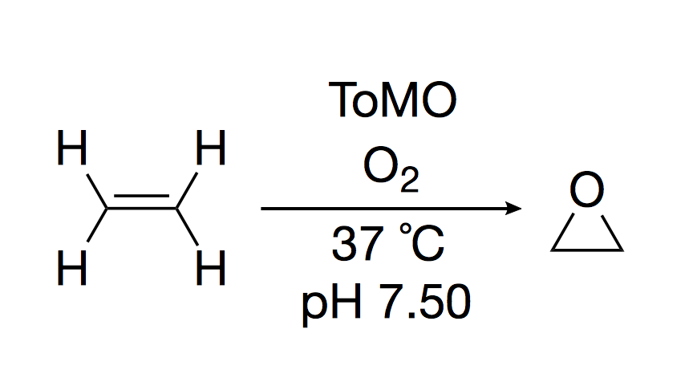
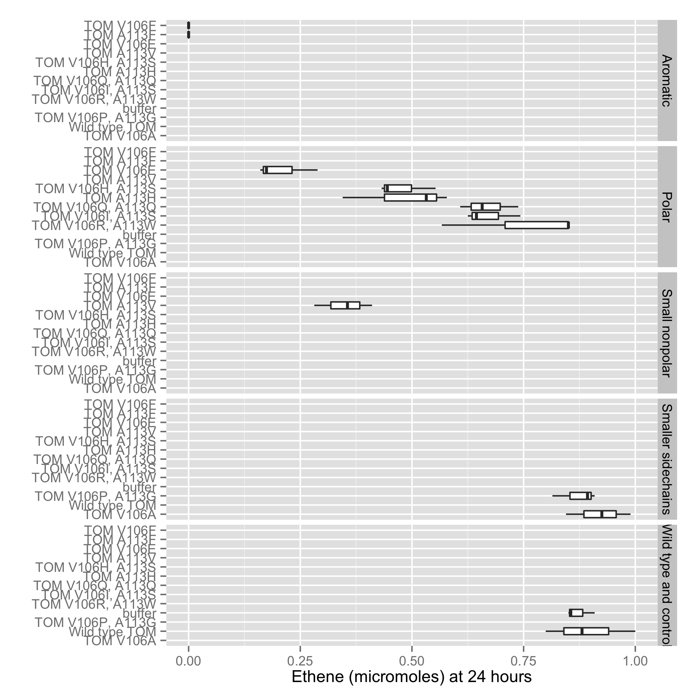

Introduction
------------

Biological catalysts are becoming the tool of choice for synthetic
reactions because of their selectivity and ability to perform reactions of
interest under mild, nontoxic conditions. One example of a synthesis
particularly suited to biological catalysis is the epoxidation of ethene to yield oxirane. 

. Reaction scheme. 

Previous reports have shown that toluene-o-xylene monooxygenase (T4MO) of *Pseudomonas stutzeri* degraded binary mixtures of chlorinated ethenes. We hypothesized that this enzyme would also show specific activity on unsubstituted ethene. To test our hypothesis that this enzyme would have specific acitivity on ethene, a directed evolution approach was chosen. A small library (n=18) of mutants was generated by shuffling mutagenesis and screened for activty on ethene as assayed by GC-FID. 

Results and discussion
----------------------

We found a variety of activites on ethene, as pictured. We observed nearly-complete degradation of ethene within 24 hours in the T4MO wild type, while wild time TOM showed no activity. A most interesting result was that a single amino acid substituion (phenylalanie for alanine at position 113 of $gene-name) renders TOM as active as T4MO on ethene. Other mutants that showed increased activity compared to wild time TOM all contained mutations where a small amino acid has been replaced by a larger one, consistent with the placement of these residues in the crystal structure (there's the argument for including a drawing of the active site). 

 Array of evolved variants of T4MO and TOM showing a wide variety of activities on ethene. 

A subset of mutants that showed complete degradation of ethene after 24 hours was tested to determine the reaction rate. The fastest mutant, TOM A113F, degraded 0.62 mM ethene (= 0.62 umol) in 220 minutes. 

 Time course of TOM A113F showing activity on ethene. 

Here we report the use of a directed evolution approach to improve the activity of toluene-o-monooxygenase on gaseous unsubstituted ethene. These findings will be useful in x, y, z. 

References
----------

+ Shim, H., et al. "Aerobic degradation of mixtures of tetrachloroethylene, trichloroethylene, dichloroethylenes, and vinyl chloride by toluene-o-xylene monooxygenase of Pseudomonas stutzeri OX1." Applied microbiology and biotechnology 56.1-2 (2001): 265-269.

+ Iwashita, Sachiyo, Hojae Shim, and Thomas K. Wood. "Directed evolution of toluene ortho-monooxygenase for enhanced 1-naphthol synthesis and chlorinated ethene degradation." Journal of bacteriology 184.2 (2002): 344-349.

Notes
-----

Wood lab uses units of nmol/min/mg of protein
